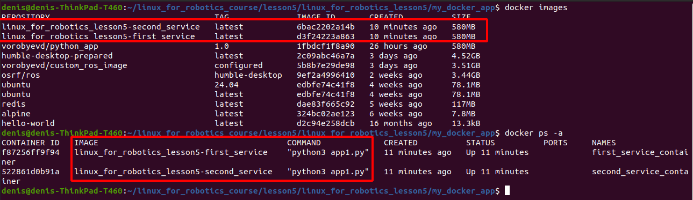

# Занятие 5. Docker.
## Описание.

Пример создания контейнеризированного приложения на основе базового образа Ubuntu:24.04, поверх которого устанавливается окружение для исполнения Python3 приложений. 

## Dockerfile:
```docker
FROM ubuntu:24.04

RUN apt update &&\ 
    apt-get install -y python3\
    python3-pip\
    nano

   	
WORKDIR /app

COPY . /app

CMD pip install -r requirements.txt

ENTRYPOINT ["/bin/bash", "start.sh"]
```
## Тестовый скрипт:

В сообщении скрипта используется переменная окружения, выставляемая при будущем запуске контейнера.

```python
#!/bin/python3

import datetime
import time
import os
name = os.environ['SERVICE_NAME']

if __name__ == "__main__":
	while True:
		now = datetime.datetime.now()
		print(f"Hello from service: {name}. current time is: {now.time()}")
		time.sleep(2)

```

## Docker-compose файл:

С помощью Docker compose происходит сборка и запуск двух независимых контейнеров на основе одного докер-файла. Независимо устанавливаются переменные окружения и имена контейнеров. Также переопределяется точка входа в контейнер по сравнению с той, которая указана в Dockerfile. 

```yaml
services:
  first_service:
    build: ./my_docker_app
    container_name: first_service_container
    environment:
      SERVICE_NAME: "MY_SERVICE_1"
    entrypoint: ["python3","app1.py"]
    stdin_open: true # docker run -i
    tty: true        # docker run -t
   
  second_service:
    build: ./my_docker_app
    container_name: second_service_container
    environment:
      SERVICE_NAME: "MY_SERVICE_2"
    entrypoint: ["python3","app1.py"]
    stdin_open: true # docker run -i
    tty: true        # docker run -t
    
```

## Запуск приложения:

1. Клонирование репозитория:
```bash
git clone git@github.com:vorobyevd/linux_for_robotics_lesson5.git
```

2. Предполагается, что docker-engine уже установлен( [инструкция по установке](https://docs.docker.com/engine/install/ubuntu/) ).  Перейти в корневую папку, содержащую файл Docker-compose.yaml и открыть терминал. Команда запуска контейнеров:
```bash 
    docker compose up
```


3. Проверка образов. В другом терминале ввести команду:

```bash
    docker images
```


4. Завершение работы и удаление образов( при необходимости ):
```bash
    docker compose down --rmi all
```
